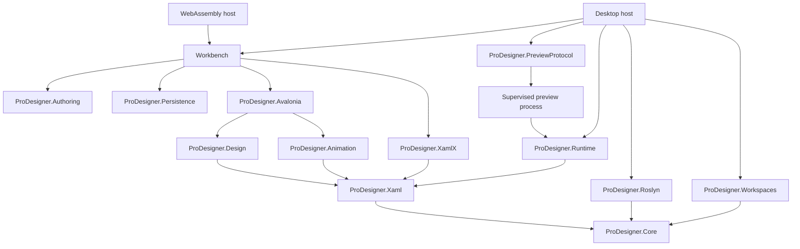

# Architecture

## Boundaries

No portable editing library depends on an application host. The browser excludes MSBuild and Roslyn. Its safe renderer and UI are real Avalonia controls compiled to WebAssembly.

## The two-tree design

XamlX is a compiler frontend, not a lossless document store. Serializing a semantic AST after every drag would destroy comments, trivia and potentially unsupported constructs. ProDesigner therefore keeps source text plus a concrete syntax tree containing element/attribute spans, and invokes the actual XamlX parser as a separate validation pass. The public CST snapshots are immutable. Existing attribute-value changes use isolated XML validation and span adjustment; structural/namespace changes use full parsing. This is not a structurally shared green/red compiler tree or a complete project-bound XAML semantic graph.

A visual operation prepares TextEdit records. EditApplication checks bounds, overlap and optional expected old text before constructing a new source string. DesignerSession validates visual transactions before publication, increments the version, records undo and notifies the UI. Invalid source edits are allowed only through the text-edit path; they preserve the last valid syntax tree and disable visual transactions. Gesture commits carry the version captured on pointer-down, preventing a stale drag from overwriting intervening edits.

Node IDs are document-local structural paths. They are not durable object identities across arbitrary structural reordering. Visual transactions reconcile selection by source spans, but durable identity across arbitrary structural changes and cross-file symbol maps remain future work. Plugins must re-resolve nodes after transactions and must not retain mutable node references across source versions.

## Preview boundary

PreviewBuilder creates only known Avalonia control types. It maps source node IDs to those controls and applies a bounded property set. It supports local scalar resource values and a small sample-data Binding lookup. Unsupported controls, properties, templates, styles and markup extensions generate diagnostics while their original source remains unchanged.

DesignSurface composes PreviewFrames, scrolling and zoom. Each frame overlays selection adorners and handles source-linked gestures. Automatic-layout controls retain their layout semantics. Free positioning, object guides, and alignment/distribution are restricted to Canvas. The preview is rebuilt after debounced source changes; selection overlays update independently.

Desktop trusted runtime preview uses Avalonia.Markup.Xaml.Loader, which executes XAML through Avalonia's XamlX pipeline. The default desktop path executes it in a supervised child process after explicit trust; the reusable runtime library also supports hosts that deliberately choose in-process loading. The desktop host now combines a cancellable SDK builder with the standalone runtime library to load project controls and code-behind roots. AssemblyDependencyResolver and a collectible load context resolve project dependencies while sharing the host’s Avalonia assemblies. This is not a sandbox or a guarantee of immediate unloading; global framework caches can retain references. The headless runtime now streams source-matched PNG frames and named-control bounds into an embedded artboard, with ordered input and reset messages. Complete application-wide resources, incompatible Avalonia major versions, exhaustive unnamed/template mapping and C# hot reload need further work.

## Roslyn and project resolution

RoslynCodeService provides syntax diagnostics, structural handler insertion, compilation member discovery and semantic rename returning a changed Solution. The UI exposes syntax diagnostics, handler generation and asynchronous project-bound XAML diagnostics. XamlCompilationService resolves concrete syntax nodes to Roslyn project/reference symbols and reports unknown types, properties, attached properties and event handlers without executing them. It is not the complete Avalonia XamlX transform pipeline. Cross-file rename application and transactional XAML/C# refactoring remain unintegrated.

WorkspaceBootstrap registers MSBuild before creating the workspace. SolutionWorkspace uses MSBuildWorkspace to load an evaluated solution and referenced projects and exposes compilation diagnostics. Its project inventory also reports raw XML framework/reference declarations; conditional and centrally managed values in that inventory are not advertised as fully evaluated metadata. Evaluation requires affirmative trust because imported targets can execute code. An explicit runtime-preview action can restore/build through DotNetProjectBuilder, using argument-list process invocation, bounded logs, cancellation and a timeout. The preview dialog offers target-framework selection from discovered project declarations. Package-management UI remains pending.

## Performance strategy

Editing and preview are debounced (180 ms for source input and 160 ms for preview scheduling). Selection does not reparse source. Drag previews mutate the preview controls and publish one source transaction on release. Compiler/project services are host-injected and kept out of the browser startup path. Source history is bounded to 200 snapshots and a 32 MiB text budget (while retaining the latest snapshot). Size/depth limits protect the parser.

Current limitations are explicit: full-document parsing, full preview rebuilds, full layer-row reconstruction despite viewport virtualization, non-virtualized property UI, snapshot history memory, synchronous XamlX validation and overlay layout work need profiling against large real applications. Parse duration in the status bar is measured; it is not a whole-frame performance claim.

## Test layers

1. Pure editing, geometry, animation and compiler service tests.
2. Avalonia.Headless integration tests over actual controls/workbench.
3. Playwright boot and command tests over the actual WebAssembly application, with screenshots and traces.

The test bridge calls the same workbench/session commands as the UI. It does not emulate the runtime. Full pointer/keyboard matrix testing, golden image comparison, screen-reader audits, memory/performance budgets and large-solution fixtures are still required for production qualification.

## 0.2 extension architecture

`ProDesigner.Authoring` builds targeted CST transactions for resources, selectors, themes and object-valued properties; its geometry model now handles every SVG path command family, expanding shorthand into explicit segments while retaining analytic arcs and Avalonia fill rules. ProDesigner.Geometry adds bounded Skia-backed Boolean and stroke-outline operations. `FragmentImporter` prepares imported fragments using their inherited namespace context and hoists declarations to the root required by Avalonia's runtime compiler. Conflicting aliases inside value tokens are rejected rather than rewritten indiscriminately. `MarkupReferences` tokenizes nested extensions and quoted arguments, restricting name rewrites to supported Binding/Reference syntax.

`ProDesigner.Persistence` serializes a checksummed, versioned workspace envelope using source-generated System.Text.Json metadata, preserving trimming compatibility in WebAssembly. Recovery stores implement a shared host contract. The desktop file store performs same-directory atomic replacement, optimistic content-hash checking and cooperative writer locking. Import constructs and validates all tabs before swapping the workbench document set.

`ProDesigner.PreviewProtocol` owns length-prefixed named-pipe framing and process supervision. The desktop executable starts a separate minimal Avalonia application in worker mode before initializing the normal workbench/MSBuild services. Workers receive already-authorized requests, load trusted project assemblies and send revision-matched success/error replies. A failed parse retains the old preview; a hung/crashed process is terminated. Live changes to the associated document are serialized and coalesced, while C# recompilation/relaunch still requires a new preview action. This is crash containment, not an OS sandbox.

The layer view uses a virtualized ListBox over flattened expand/collapse rows. Source-node lookup uses a dictionary, and offset lookup uses binary search followed by ancestor traversal. Visual transactions map selection through their text edits. Version 0.4 adds process-local reconciled node identities, immutable public collections, incremental existing-attribute values and conservative safe-preview scalar deltas. Compiler-level structural sharing and full incremental XamlX transforms remain future work.

See [the 0.4 guide](embedded-preview-vector-recovery.md) for rendering transport, native geometry, source-delta and journal-review contracts.
